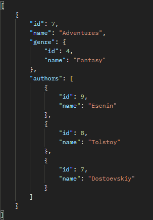
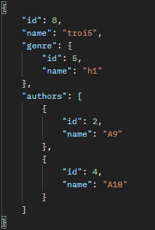
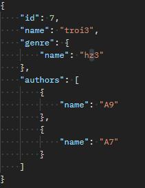
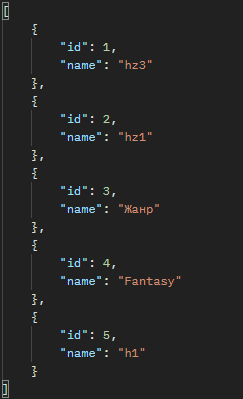
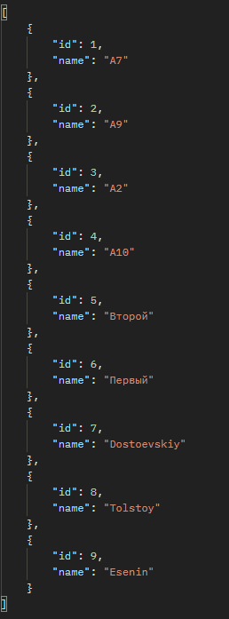

# GET /books

## Описание

Получение списка всех книг.

## Параметры

Отсутствуют.

## Пример запроса

GET /books HTTP/1.1\
Host: example.com\
Accept: application/json

## Пример ответа

HTTP/1.1 200 OK\
Content-Type: application/json

# POST /books/create

## Описание

Создание новой книги.\

## Параметры

Объект книги.
В качестве жанра и авторов указываются объекты с именами.

## Пример запроса

POST /books/create HTTP/1.1\
Host: example.com\
Accept: application/json

## Пример ответа

HTTP/1.1 200 OK\
Content-Type: application/json

# PUT /books/edit

## Описание

Редактирование уже существующей книги.

## Параметры

Объект книги.
В качестве жанра и авторов указываются объекты с именами.

## Пример запроса

PUT /books/edit HTTP/1.1\
Host: example.com\
Accept: application/json

## Пример ответа

HTTP/1.1 200 OK\
Content-Type: application/json

# DELETE /books/delete/{id}

## Описание

Удаление книги по id.

## Параметры

В url передается id книги.

## Пример запроса

DELETE /books/delete/7 HTTP/1.1\
Host: example.com\
Accept: application/json

## Пример ответа

HTTP/1.1 200 OK\
Content-Type: application/json

# GENRES

# GET /genres/all

## Описание

Возвращает все имеющиеся жанры с их id и именем.

## Параметры

Отсутствуют.

## Пример запроса

GET /genres/all HTTP/1.1\
Host: example.com\
Accept: application/json

## Пример ответа

HTTP/1.1 200 OK\
Content-Type: application/json

# Authors

# GET /authors/all

## Описание

Возвращает всех авторов с их id и именем.

## Параметры

Отсутствуют.

## Пример запроса

GET /authors/all HTTP/1.1\
Host: example.com\
Accept: application/json

## Пример ответа

HTTP/1.1 200 OK\
Content-Type: application/json

