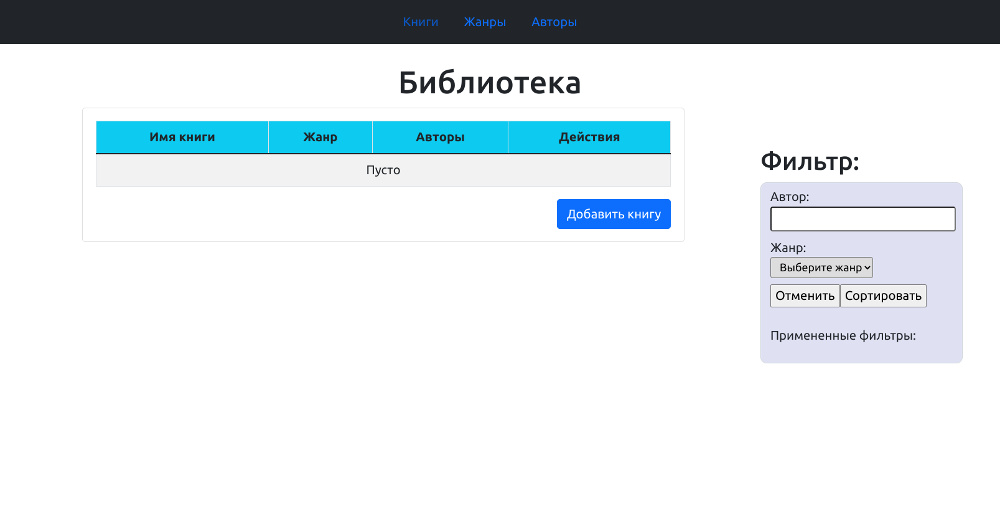
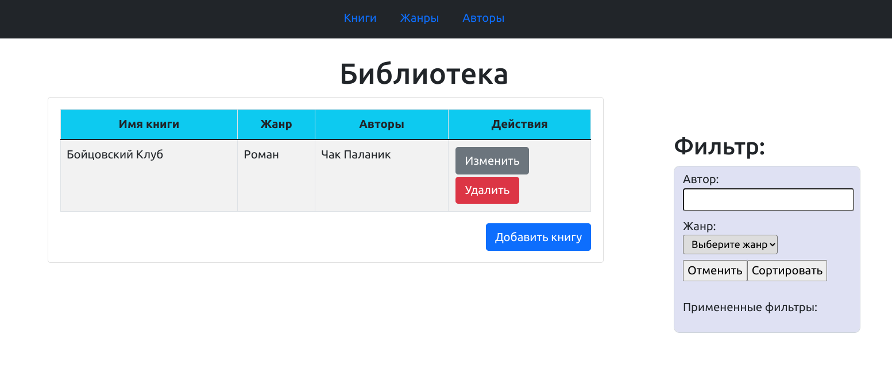
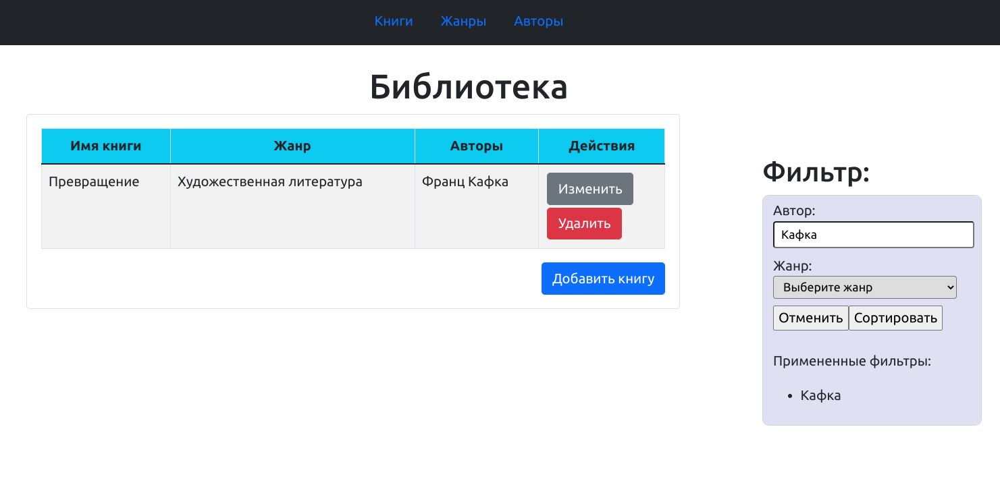
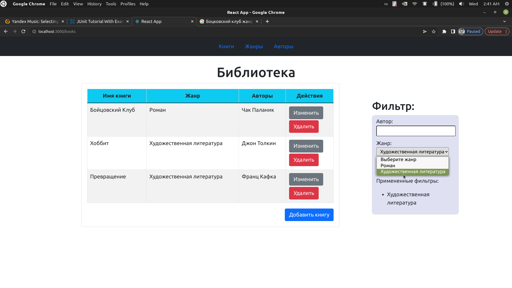
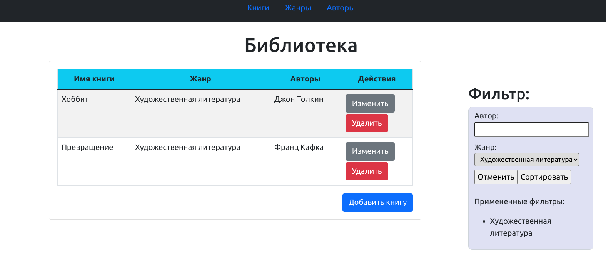
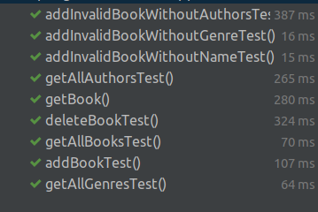

Тест-план приложения "Library".

### Содержание
  1. [Введение](#1)
  2. [Объект тестирования](#2)
  3. [Атрибуты качества](#3)
  4. [Риски](#4)
  5. [Аспекты тестирования](#5)
  6. [Подходы к тестированию и их реализация](#6)
  7. [Представление результатов](#7)
  8. [Выводы](#8)

### 1. Введение

Данный план предназначен для тестирования приложения "Library". Цель проведения тестирования - проверка работоспособности и пригодности приложения для практического использования ручным способом, а также автоматическое тестирование отдельных компонентов пользовательского интерфейса и их совместного использования

### 2. Объект тестирования

В качестве объектов тестирования можно выделить атрибуты качества платформы по ISO 25010:

1. функциональность

	- функциональная полнота: приложение должно выполнять все заявленные функции
	- функциональная корректность: приложение должно выполнять все заявленные функции корректно
	- функциональная целесообразность: отсутствуют не заявленные функции, которые бы мешали приложению выполнять первоначально поставленные задачи

2. удобство использования

	- эстетика пользовательского интерфейса: элементы управления объектами должны быть всегда доступны пользователю
	- уведомление пользователя о неправильных действиях: приложение должно сообщать пользователю об ошибках и о неправильном использовании

### 3. Атрибуты качества

1. Функциональность:

    - функциональная полнота: приложение должно соответствовать всем функциональным требованиям;
    - функциональная целесообразность: отсутствуют не заявленные функции, которые бы мешали приложению выполнять поставленные задачи
    
2. Удобство использования:

    - простота пользовательского интерфейса: интерфейс должен быть достаточно простым для интуитивного использования новым пользователем
    
3. Кроссплатформенность:

    - корректная работа приложения на платформах:
      - Windows
      - Linux.
    
    Корректная работа приложения гарантирована на любой платформе в рамках браузеров из следующего списка: Google Chrome версии 96.0 и выше, Mozilla Firefox версии 98.0 и выше, Opera версии 70.0 и выше, Microsoft Edge версии 100 и выше
      
4. Адаптивность

    - возможность комфортного использования приложения как на компьютере, так и на мобильном устройстве.

### 4. Риски
Приложение не использует функций и особенностей конкретных браузеров, возможно использование во всех браузерах, указанных в SRS, начиная с указанных версий.

### 5. Аспекты тестирования

Для проведения тестирования приложения необходимо определить каким образом оно будет происходить. Для лучшего понимания рассмотрим основные виды тестирования.

1. Автоматизированное тестирование
2. Ручное тестирование

Автоматизированное тестирование программного обеспечения — часть процесса тестирования на этапе контроля качества в процессе разработки программного обеспечения. Оно производится с помощью специальных библиотек и фреймворков для тестирования.
Ручное тестирование — часть процесса тестирования на этапе контроля качества в процессе разработки программного обеспечения. Оно производится тестировщиком без использования программных средств, для проверки программы или сайта путём моделирования действий пользователя.

Автоматизированное тестирование можно разделить на несколько подвидов:

1. Unit тестирование
2. Интеграционное тестирование
3. End-to-end тестирование

Unit тестирование проводится для тестирования отдельных блоков или компонентов приложения в полной изоляции.
Интеграционное тестирование проводится для тестирования работы взаимодействия отдельных компонентов приложения.
End-to-end тестирование это полноценное тестирование приложение с имитацией всех возможных действий пользователя на странице.

Данное приложение будет тестироваться ручным способом, а также автоматизированно с помощью unit тестов.

### 6. Подходы к тестированию и их реализация

Проведём тестирование процесса просмотра книг и выполнения различных операций с ними ручным способом при запуске приложения локально:

Для запуска приложения переходим по ссылке http://localhost:3000/ и попадаем на главную страницу приложения. 

На главной странице мы видим список всех представленных книг. Попробуем добавить книгу.

Если данные будут пустыми, то добавление книги не происходит

Вводим данные и нажимаем на кнопку добавления. Книга должна успешно добавиться в общий каталог

При выборе всего каталога книг происходит загрузка всех книг. В случае если книг нет - отображается соответствующее сообщение.

При изменении книги все параметры книги отображаются корректно.

Список жанров и авторов отображается корректно без дублирований.

Поиск работает корректно. При вводе имени автора отображаются только книги определенного автора.

При выборе параметра жанров отображаются жанры имеющихся книг.

После сортировки корректно отображаются книги выбранного жанра

Функция, протестированная системным тестированием, будет считаться прошедшей тест при условии, что сервер приложений вернет HTTP-ответ либо с кодом 2xx, либо с кодом 3xx.

Особое внимание стоит уделить проверке нормального соединения с базой данных. В случае ошибки подключения к базе данных SQL

Любые процессы тестирования должны быть немедленно остановлены. Тестирование может быть продолжено только в том случае, если проблема с подключением к базе данных устранена и приложение снова может корректно взаимодействовать с базой данных.

Как упомяналось выше представлены юнит тесты. Как среда для запуска тестов для написания unit тестов была использована библиотека JUnit.

Для запуска всех автоматизированных тестов в корне проекта необходимо перейти в каталог test/java/com/example/springboot и запустить выполнение тестов в приведенном классе.

Результат запуска всех тестов

### 8. Выводы
Данный тестовый план позволяет протестировать основной функционал приложения. Успешное прохождение всех тестов не гарантирует полной работоспособности на всех платформах и архитектурах, однако позволяет полагать, что данное программное обеспечение работает корректно.
